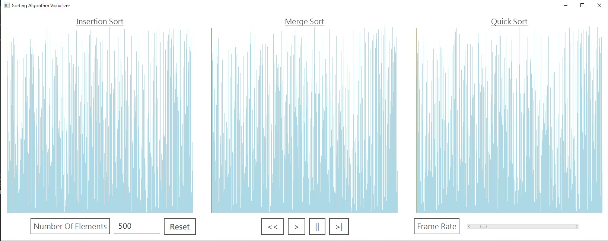
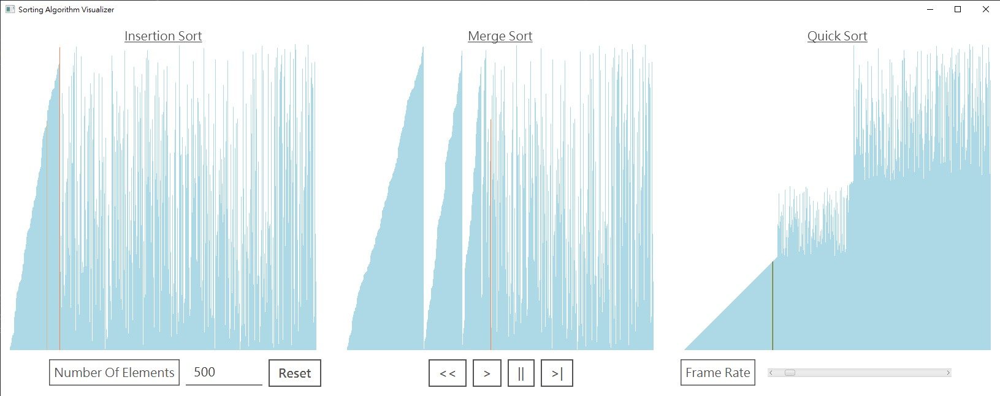

# Sorting Visualization

Welcome! This is a sorting visualizer written in Java with JavaFX. 
This sorting visualizer can show multiple sorting algorithms concurrently. 

# Sorting Animation Controlling

There's a control bar in the bottom center of the screen with 4 buttons

|Buttons|Function|
|---|---|
|<<|Reset sorting animation|
|\>|Start or resume|
|&#124;&#124;|Pause|
|\>&#124;|Play the next frame|

I implement the animation controlling mechanism with the concept of finite-state machine.

# Adding New Sorting Algorithms

Adding new sorting algorithms to the program is rather easy in that there's no need to 
handle the rendering of the animation manually.

The array for storing the sorting elements is encapsulated into `SortArray`. Pointers to 
the elements of the array is also encapsulated into `Pointer`.

I bring these encapsulations to the program to automate the rendering of the sorting animations.
Everytime the sorter (`Sorter`) accesses (get or set) an element in the `SortArray`, it is paused and a new frame is rendered.

Sorters only continue computing the next frame once all of them have computed the currently frame.

Please note that currently you still need to manually add a new GUI panel to show the new sorting algorithm you have written.

